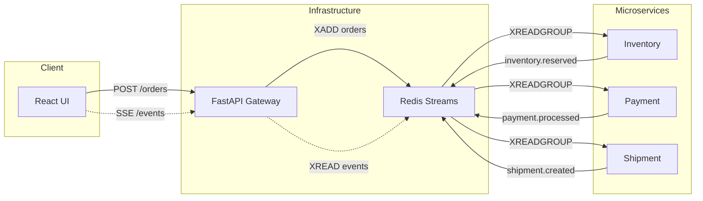

# Event-Driven Order Processing

Order processing system built on an event-driven microservices architecture. Three independent services -- Inventory, Payment, and Shipment -- communicate through **Redis Streams** instead of calling each other directly. A React frontend shows the event chain in real time.

## Why Event-Driven for E-Commerce?

In a traditional (synchronous) order processing system, the gateway would call Inventory, wait for a response, then call Payment, wait again, then call Shipment. Every service is chained through direct HTTP calls. If Shipment is slow or down, the entire order request hangs or fails -- one broken link kills the whole chain.

With event-driven architecture, the gateway publishes the order to a stream and immediately responds to the user. Each service picks up work at its own pace from the message broker. This matters in e-commerce because:

- **Spikes are absorbed, not rejected.** During a flash sale, thousands of orders hit the gateway. Instead of overwhelming downstream services with synchronous calls, orders queue up in Redis Streams and services consume them as fast as they can. No dropped requests, no timeouts.
- **Failures are isolated.** If the Shipment service crashes, orders still get placed and paid. The shipment events wait in Redis until the service recovers. In a synchronous system, the entire checkout would fail.
- **Services scale independently.** Payment processing is slower than inventory checks. With events, you can run 3 Payment containers and 1 Inventory container -- each scales based on its own bottleneck, not the bottleneck of the slowest service in the chain.

### How This Improves CI/CD

The event-driven approach directly benefits the deployment pipeline:

- **Independent deployments.** Each microservice has its own Dockerfile, its own codebase, its own container. You can deploy a new version of Payment without touching Inventory or Shipment. In a monolith or tightly coupled system, changing one piece risks breaking everything.
- **Zero-downtime deploys.** When you redeploy the Shipment service, its container goes down briefly. During that window, events accumulate in Redis instead of failing. When the new container starts, it picks up where the old one left off. The deploy is invisible to the user.
- **Smaller blast radius.** A bad deploy to one service doesn't cascade. If a buggy Inventory release starts rejecting events, Payment and Shipment keep running fine on their existing workload. You roll back one container, not the whole system.
- **Faster pipelines.** Three small services mean three small Docker images, three fast test suites, three independent CI pipelines. A change to shipment logic doesn't trigger inventory tests.

## Architecture



### Components

| Component | Role | Microservice? |
|---|---|---|
| **Inventory Service** | Reserves product stock for an order | Yes |
| **Payment Service** | Processes payment | Yes |
| **Shipment Service** | Creates shipping label and tracking number | Yes |
| **FastAPI Gateway** | Entry point -- publishes orders to Redis, streams events to the UI via SSE | No (API Gateway) |
| **React Frontend** | Order form + live event feed | No (Client) |
| **Redis** | Message broker with Streams and consumer groups | No (Infrastructure) |

### Event Chain

1. Gateway receives an order and publishes it to the `orders` stream
2. Inventory reads from `orders`, reserves stock, publishes `inventory.reserved` to the `events` stream
3. Payment reads `inventory.reserved`, processes the charge, publishes `payment.processed`
4. Shipment reads `payment.processed`, assigns a carrier and tracking number, publishes `shipment.created`
5. The frontend receives every event in real time through SSE

Each service uses `XREADGROUP` (Redis consumer groups), which means messages are durable -- if a service goes down, pending messages wait in the stream until it comes back.

## Prerequisites

[Docker](https://docs.docker.com/get-docker/) and Docker Compose.

## Seeing It in Action

### Starting the system

```bash
docker-compose up --build
```

This brings up 6 containers: Redis, Gateway, Inventory, Payment, Shipment, and Frontend. The services wait for Redis to pass its health check before starting.

### Submitting an order

We open http://localhost:3000, add a couple of products to the cart, and submit. On the right panel we can see events appearing in real time as they flow through the chain:

- `order.created` -- the gateway accepted the order
- `inventory.reserved` -- stock was reserved
- `payment.processed` -- the charge went through
- `shipment.created` -- a tracking number was assigned

We can submit a second order to see the chain run again independently.

### Checking the logs

```bash
docker-compose logs -f
```

Here we can see each service logging what it's doing in its own output. They're separate processes in separate containers -- the only thing they share is the Redis connection. We can also filter to a single service:

```bash
docker-compose logs -f payment
```

### Testing resilience

This is where it gets interesting. We stop the Shipment service while the system is running:

```bash
docker-compose stop shipment
```

Now we submit a new order. The UI shows events up to `payment.processed` but no `shipment.created` -- the event is sitting in Redis, waiting for a consumer that isn't there.

We bring it back:

```bash
docker-compose start shipment
```

The `shipment.created` event appears in the UI. The service picked up the pending message automatically. No messages were lost -- this is Redis Streams with consumer groups retaining unacknowledged messages until a consumer comes back to process them.

### Inspecting Redis directly

We can look at the raw events stored in the stream:

```bash
docker exec -it eventbased-redis-1 redis-cli XRANGE events - +
```

Every event is persisted with all its fields. We can also check what messages are pending in a consumer group:

```bash
docker exec -it eventbased-redis-1 redis-cli XPENDING events shipment-group - + 10
```

## Project Structure

```
EventBased/
├── docker-compose.yml
├── gateway/                    # API Gateway
│   ├── Dockerfile
│   ├── requirements.txt
│   └── main.py                 # POST /orders, GET /events (SSE)
├── services/
│   ├── inventory/
│   │   └── main.py             # orders -> inventory.reserved
│   ├── payment/
│   │   └── main.py             # inventory.reserved -> payment.processed
│   └── shipment/
│       └── main.py             # payment.processed -> shipment.created
└── frontend/
    ├── Dockerfile
    ├── package.json
    └── src/
        └── App.tsx             # Order form + live event timeline
```

## Tech Stack

| | Technology |
|---|---|
| Frontend | React, TypeScript, Vite |
| Gateway | Python, FastAPI, SSE |
| Broker | Redis Streams |
| Services | Python, redis-py |
| Orchestration | Docker Compose |
